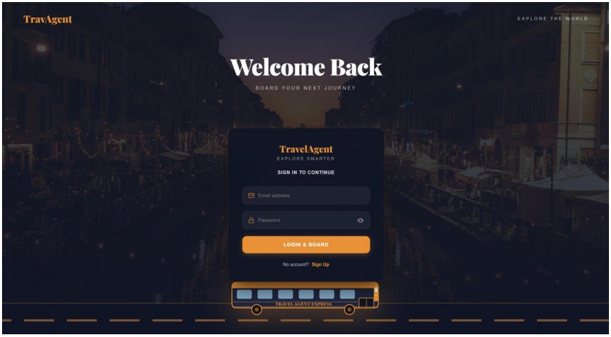
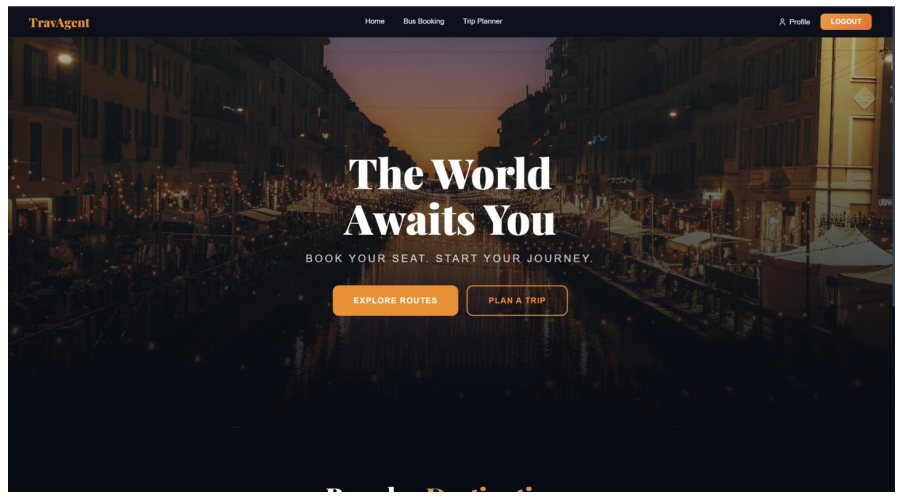
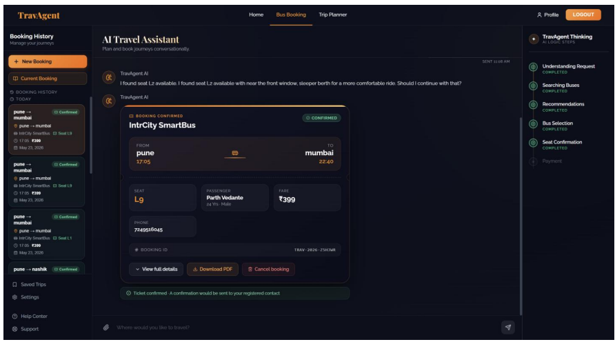
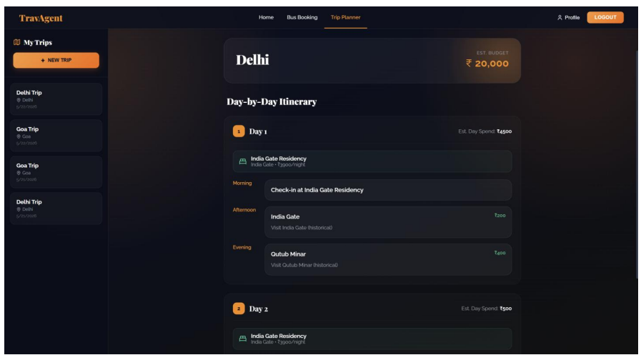
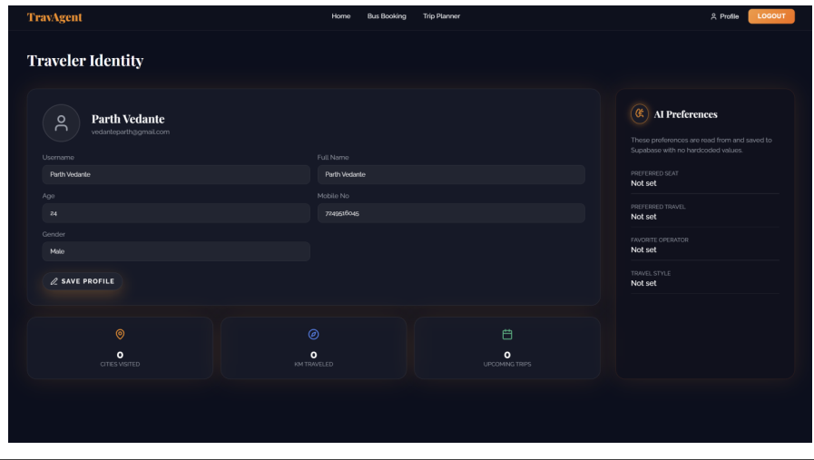

# 🚌 TravAgent - AI-Powered Conversational Travel & Bus Booking System

> Not a form to fill — but an intelligent conversation to have.

## 📖 Overview

TravAgent is an AI-powered conversational travel platform that transforms traditional bus booking and travel planning into a natural language experience. Instead of filling multiple forms, comparing routes manually, and repeatedly entering preferences, users simply converse with an AI assistant that understands travel requirements, recommends the best options, optimizes seat selection, and completes bookings.

The project demonstrates the integration of Large Language Models (LLMs), conversational workflow orchestration, recommendation systems, memory-aware personalization, and modern full-stack development into a unified travel intelligence platform.

---

## 🎯 Problem Statement

Traditional travel booking systems require users to:

* Manually search routes and schedules
* Compare buses individually
* Re-enter preferences every booking
* Navigate complex booking forms
* Restart bookings after interruptions

Most existing platforms lack:

* Conversational understanding
* Personalized recommendations
* User preference memory
* Session restoration
* AI-assisted decision making

TravAgent addresses these limitations through an AI-first conversational booking experience.

---

## ✨ Features

### 🗣️ Conversational Bus Booking

Book buses through natural language conversations.

**Example:**

> "Book me a bus from Pune to Mumbai tomorrow morning."

The AI extracts:

* Source
* Destination
* Travel Date
* Preferences

and handles the complete workflow automatically.

---

### 🤖 AI-Powered Recommendation Engine

TravAgent intelligently ranks buses into three categories:

#### ⭐ Best Overall

Optimal balance of:

* Price
* Ratings
* Journey Duration

#### 💰 Budget Friendly

Lowest practical fare with acceptable ratings.

#### 👑 Premium Comfort

Highest-rated luxury travel option.

Each recommendation includes AI-generated reasoning to help users make informed decisions.

---

### 💺 Memory-Aware Seat Optimization

The system remembers:

* Window seat preference
* Preferred travel timings
* Favorite bus operators

Future bookings automatically leverage these preferences to personalize recommendations and seat selection.

---

### 🔄 Persistent Session Restoration

Booking progress is never lost.

TravAgent restores:

* Chat history
* Booking workflow state
* Selected bus
* Seat selection
* Generated tickets

even after page refreshes or browser restarts.

---

### 🎫 Smart Ticket Generation

Generate digital tickets containing:

* Booking ID
* Journey Details
* Seat Number
* Operator Information
* QR Visualization

with a smooth animated ticket reveal experience.

---

### 🗺️ AI Trip Planner

Beyond bus booking, TravAgent includes a Trip Planner Agent capable of:

* Destination exploration
* Travel recommendations
* Itinerary generation
* Hotel suggestions

through conversational interactions.

---

### 📊 Live Workflow Visualization

Users can view real-time booking progress through a workflow panel that displays:

* Current stage
* Completed steps
* Next expected action

providing transparency and trust in AI-driven workflows.

---

## 🏗️ System Architecture

### Frontend

* React.js
* Vite
* Tailwind CSS
* Zustand State Management

### Backend

* FastAPI
* Python

### Database

* Supabase
* PostgreSQL

### AI Layer

* Qwen Large Language Model

### Development Services

* Mock Bus API Server

---

## 🔄 Booking Workflow

```text
User Request
      ↓
Intent & Entity Extraction
      ↓
Bus Search
      ↓
AI Recommendation Ranking
      ↓
Bus Selection
      ↓
Preference Retrieval
      ↓
Seat Optimization
      ↓
Seat Confirmation
      ↓
Ticket Booking
      ↓
Ticket Generation
      ↓
Memory Learning
      ↓
Session Persistence
      ↓
Session Restoration
```

---

## 🧠 Memory & Session Architecture

### Conversational Memory

Stored User Preferences:

* Seat Preference
* Preferred Travel Time
* Preferred Bus Operator

### Session Restoration

Each booking stores:

* Conversation Thread
* Workflow State
* Selected Bus
* Selected Seat
* Ticket Information

On reload:

```text
Frontend
    ↓
Load Session ID
    ↓
GET Session API
    ↓
Backend Restoration
    ↓
State Rehydration
    ↓
Complete UI Reconstruction
```

---

## 🛠️ Technology Stack

| Category         | Technology           |
| ---------------- | -------------------- |
| Frontend         | React.js, Vite       |
| Styling          | Tailwind CSS         |
| State Management | Zustand              |
| Backend          | FastAPI              |
| Database         | Supabase, PostgreSQL |
| AI Model         | Qwen LLM             |
| APIs             | Mock Bus API         |
| Language         | Python, JavaScript   |

---

## 📂 Project Structure

```bash
TravAgent/
│
├── frontend/
│   ├── src/
│   ├── components/
│   ├── pages/
│   ├── store/
│   └── services/
│
├── backend/
│   ├── agents/
│   ├── routers/
│   ├── services/
│   ├── models/
│   ├── database/
│   └── api/
│
├── screenshots/
│   ├── home.png
│   ├── chat.png
│   ├── recommendations.png
│   ├── workflow.png
│   └── ticket.png
│
├── docs/
│   └── TravAgent_Project_Report.pdf
│
└── README.md
```

---

## 🚀 Advantages

* AI-first booking experience
* Personalized recommendations
* Persistent conversational memory
* Session recovery and restoration
* Explainable AI decisions
* Modular backend architecture
* Scalable workflow design
* Modern user interface

---

## ⚠️ Current Limitations

* Uses mock bus data
* No real payment integration
* Dependent on Qwen LLM availability
* No live GPS tracking
* English-only support
* No real ticket validation system

---

## 🔮 Future Scope

* Real Bus API Integration
* Razorpay / Stripe Payments
* Hotel Booking Integration
* Flight Booking Module
* Voice Assistant Support
* Multi-Language Support
* Real-Time Bus Tracking
* Mobile Application
* AI Travel Companion
* Predictive Travel Recommendations
* Smart Budget Planning
* Dynamic QR Ticket Validation

---

## 📸 Screenshots

<p align="center">
  
  
  
  
  
</p>

## 👨‍💻 Team

| Name            | PRN        |
| --------------- | ---------- |
| Samiksha Jadhav | 12520100   |
| Rutuja Ughade   | 12520108   |
| Parth Vedante   | 1252080016 |
| Prachi Ankush   | 1252080018 |

---

## 🎓 Academic Information

**Project Title:** TravAgent – AI-Powered Conversational Travel & Bus Booking System

**Domain:** Agentic Artificial Intelligence

**Institution:** Vishwakarma Institute of Technology (VIT), Pune

**University:** Savitribai Phule Pune University

**Academic Year:** 2025–2026

**Project Guide:** Prof. Rahul Pawar

---

## 📚 References

* Qwen Technical Report
* FastAPI Documentation
* Supabase Documentation
* React Documentation
* PostgreSQL Documentation
* Tailwind CSS Documentation
* Zustand Documentation

---

## 🌟 Vision

TravAgent reimagines travel booking as an intelligent conversation rather than a repetitive form-filling exercise. By combining conversational AI, personalization, recommendation systems, and persistent memory, the platform demonstrates the future of AI-driven travel experiences.
